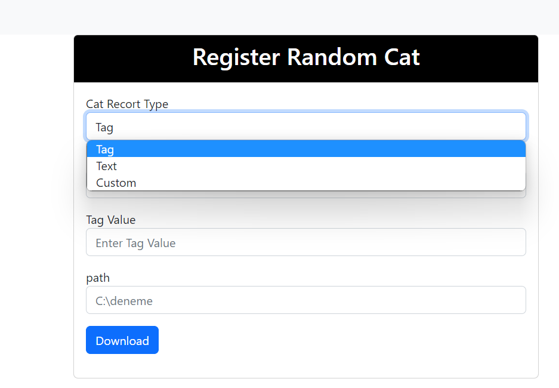
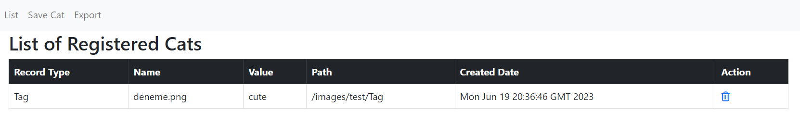

# CatService

# Environment
```bash
* Spring Boot 3.1.0
* Thymeleaf
* Mongo Database
```

# Variable
```bash
* application.properties
    * spring.data.mongodb.uri=mongodb://admin:admin@ip:27017/cat?authSource=admin&readPreference=primary&ssl=false
    * spring.data.mongodb.database=cat
 ```

# Maven Build Installation
```bash
cd Dosya Dizini (Pom.xml)
./mvnw package
java -jar .\target\cyangate-0.0.1-SNAPSHOT.jar
```
# Test
http://localhost:8080/cat


# Docker Installation
```bash
docker build -t service:1.0 .
docker run -d -p 8081:8080  --name deneme docker.io/library/service:1.0
```
# Test
http://ip:8081/cat

# User Interface 

 * Save/Download  



 * List



 * Export: Export file(export.xlsx) is inside the project folder


 